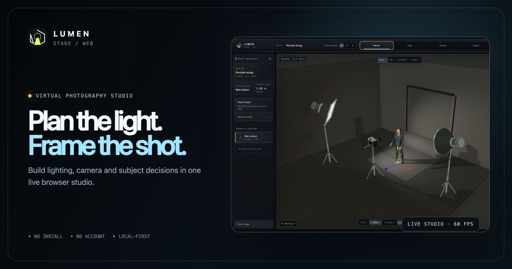

# Lumen Stage — Live Website

[Open the GitHub Pages website](https://clark970417-eng.github.io/lumen-stage-pages/)

Lumen Stage is a browser-based virtual photography studio for planning subjects, lighting, cameras, lenses, framing, and stage layouts in one interactive 3D workspace.

## What this repository contains

This public repository contains only the compiled static website used by GitHub Pages. The private development repository, source history, and local project files are not included.

The website supports:

- a responsive Traditional Chinese, English, and Japanese landing page;
- full and simplified studio interfaces;
- a live Three.js photography stage with rigged people, lights, cameras, and backdrops;
- local browser storage and shareable scene links;
- downloadable multilingual guides.

## Privacy and network requirements

Scenes and imported files stay in the visitor's browser by default. The app requires a modern WebGL-capable browser. GitHub Pages provides the static hosting and may process normal network logs under GitHub's policies.

## Rights

Interface, brand, and original content © YuYing. All rights reserved. Public access to this compiled website does not grant permission to redistribute its source or brand assets.
